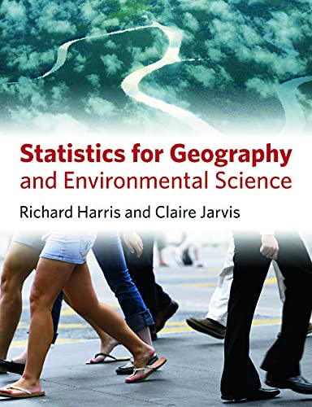
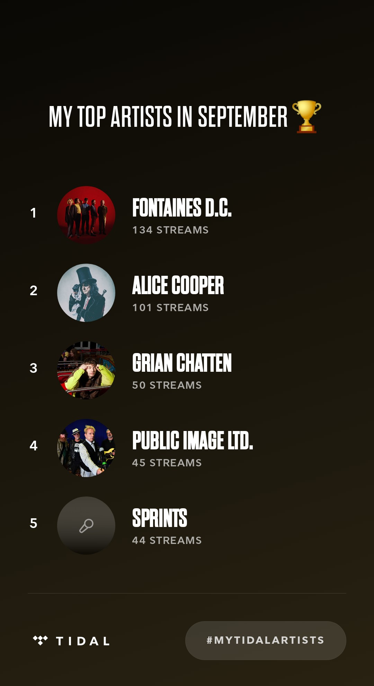

```{r setup, include=FALSE}
knitr::opts_chunk$set(echo = TRUE)
```

## About Me

{width=200}

I am a social geographer in the [School of Geographical Sciences](http://www.bristol.ac.uk/geography/) interested in **socio-spatial inequalities** within society and their causes. Presently I am Director of the [South West Doctoral Training Partnership](https://www.swdtp.ac.uk/) and was founding director of [the University of Bristol](https://www.bristol.ac.uk/)’s £1.3 million funded [Q-Step Centre](https://www.nuffieldfoundation.org/students-teachers/q-step) for undergraduate, quantitative social science.

My early research looked at the application of spatial statistics, geographic information science and geodemographics in marketing, public policy and urban geography – all examples of what are now described as **geographic data science**. More recent work has been in urban analytics and cartographic geovisualisation of administrative datasets, focusing on developing and applying innovative computational methods to analyse the **geographies of Covid-19**, to measure and to visualise spatial scales of **social and ethnic segregation**, and to study choice and markets in educational systems; also in the **geographies of education**, supporting quantitative and statistical literacy amongst geographers and undergraduate and postgraduate social scientists.

I am a Fellow of the [Academy of Social Sciences](https://acss.org.uk/) and of the [Royal Geographical Society (with IBG)](https://www.rgs.org/). I am also a licensed lay minister in the [Church of England](https://www.churchofengland.org/) so have some theological interests too.

[\@profrichharris on Twitter](https://twitter.com/profrichharris)


## Key Research Interests

Social Geography. Quantitative Methods and Geographic Data Science. Socio-spatial inequality. Geographies of education.

Some (very) recent research presentations are [here](https://profrichharris.github.io/presentations/presentations.html)

## Online courses

[Mapping and Modelling Geographic Data in R](https://profrichharris.github.io/MandM/){target="_blank"}

## Publications

[My University of Bristol Research Information pages](https://research-information.bris.ac.uk/en/persons/richard-j-harris)

[My ORCiD page](https://orcid.org/0000-0001-7943-9005) (includes some papers I had forgotten about)

[My RPubs page](https://rpubs.com/profrichharris) (occasional tutorials, working ideas, supplementary material and other 'stuff' [in R](https://cran.r-project.org/))


## Books

[**Ethnic Segregation Between Schools**](https://bristoluniversitypress.co.uk/ethnic-segregation-between-schools) (with Ron Johnston)

{width=80}

[**Quantitative Geography: The Basics**](https://www.google.co.uk/books/edition/Quantitative_Geography/RsbmDAAAQBAJ?hl=en&gbpv=1&printsec=frontcover)

{width=80}

[**Statistics for Geography and Environmental Science**](https://www.google.co.uk/books/edition/Statistics_for_Geography_and_Environment/JJZ9AwAAQBAJ?hl=en&gbpv=1&printsec=frontcover){width=20} (with Claire Jarvis)

{width=80}

[**Geodemographics, GIS and Neighbourhood Targeting**](https://www.google.co.uk/books/edition/Geodemographics_GIS_and_Neighbourhood_Ta/f62DTuyRe0UC?hl=en&gbpv=1&printsec=frontcover) (with Peter Sleight and Richard Webber)

{width=80}

## Come Study With Me!

I have supervised PhD students from across the world, including Europe, Asia, Africa and the Middle East. Applicants are invited in topics aligned with my research interests. Please see the [School of Geographical Sciences webpages](http://www.bristol.ac.uk/geography/courses/postgraduate/humanphd.html) for funding opportunities and how to apply.


## Listening choices

What I have been listening to on [Tidal](https://tidal.com/) (December 2022). Excludes my vinyl choices! 
{width=300}


### Credits

This website was authored in [R Markdown](https://rmarkdown.rstudio.com/) using the downcute chaos theme by [Zac Garland](https://github.com/zac-garland) available in the [rmdformats](https://cran.r-project.org/web/packages/rmdformats/) library. It is hosted using [GitHub Pages](https://pages.github.com/).
