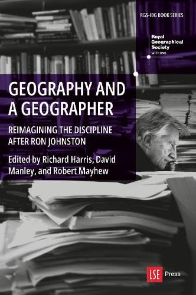

```{r setup, include=FALSE}
knitr::opts_chunk$set(echo = TRUE)
```
 
{width="200" style="display:block;margin:0 auto;"}


> *Geography and a Geographer* speaks to the work and influence of a man who shaped, profoundly, the discipline he professed. Intellectually curious, always collegial, astonishingly productive and forward thinking about geography’s past and present, Ron Johnston was geography’s modest colossus. This book is a tribute and a clarion call for geography in better futures</br></br>(Charles W. J. Withers, Professor Emeritus of Historical Geography, The University of Edinburgh)
 

# Learn More
[About the book](https://press.lse.ac.uk/books/e/10.31389/lsepress.gag){target="_blank"} at the publisher's website

# Ron's Publication List
**Coming Soon**
